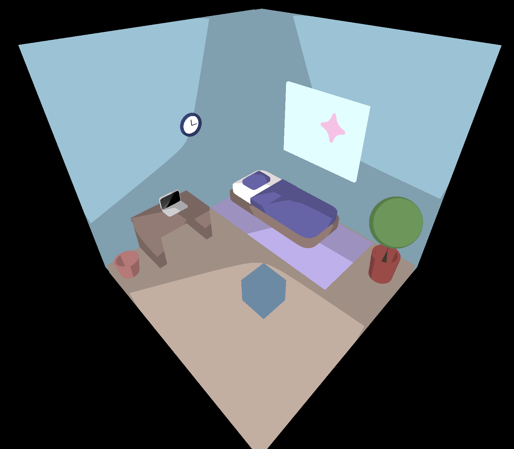
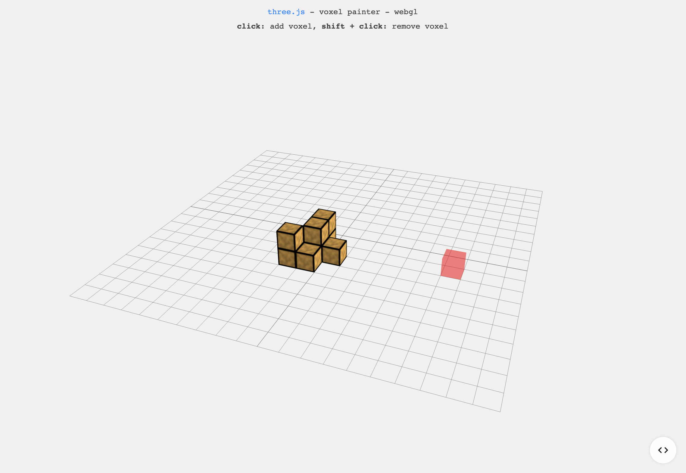
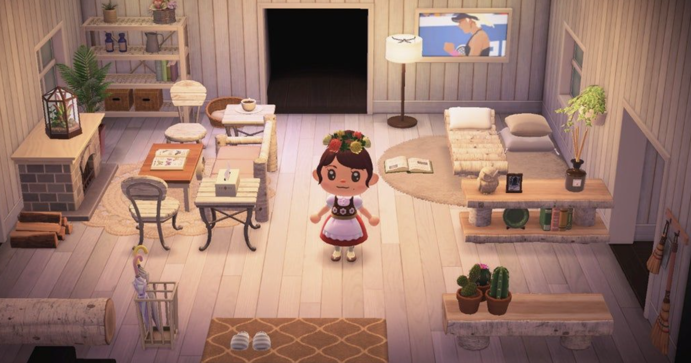

Final Project Concept
------

For my final project, I would like to create a new iteration of my interaction project (week 10). I want to create a simple interior decorating game where you can add different furnitures and move/rotate them within a room. I am planning on using raycasting for object interaction and spline for simple 3d modeling.

### References

Three.js projects:
- https://threejs.org/examples/#webgl_interactive_voxelpainter
- https://threejs.org/examples/#webgl_animation_keyframes

Preexisting games:
- Sims
- Minecraft
- Animal Crossing

### Plan:

- Week 1: create 3d models, set up click/place interaction with cubes
- Week 2: replace cubes with 3d models, add tutorial text
